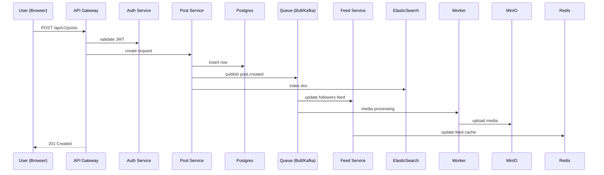
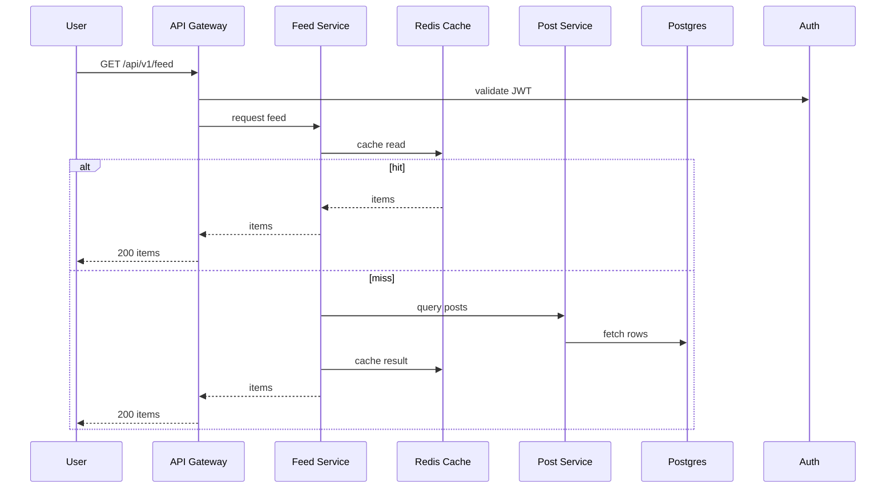
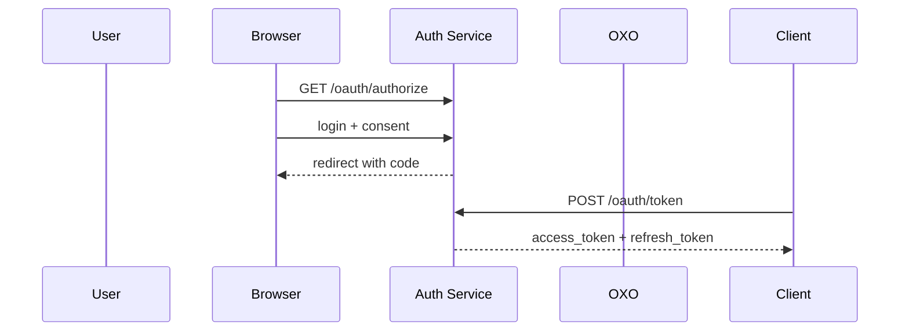

# 📐 Backend Architecture - OXO

## 1. Kiến trúc tổng thể (High-level system architecture)

```mermaid
flowchart LR
  subgraph External
    U[User Browser / Mobile]
    Dev[Developer (for BridgeX later)]
    CDN[CDN]
  end

  subgraph Edge
    Ingress[Ingress / API Gateway\n(Nginx / Envoy)]
    AuthN[AuthN Proxy / WAF]
  end

  subgraph Cluster["Kubernetes Cluster (oxo)"]
    subgraph AppNS["namespace: oxo-app"]
      Front[Next.js Frontend]
      API[API Gateway (Envoy/Kong) - internal]
      AuthSvc[Auth Service (NestJS)]
      UserSvc[User Service (NestJS)]
      PostSvc[Post Service (NestJS)]
      FeedSvc[Feed Service (NestJS)]
      MediaSvc[Media Service (Upload/Presign)]
      Notification[Notification Service (WS/SSE)]
      Worker[Worker Pool (BullMQ) / Kafka Consumers]
      Cron[CronJobs]
    end

    subgraph InfraNS["namespace: oxo-infra"]
      Postgres[(PostgreSQL + replica)]
      Redis[(Redis Cluster)]
      Queue[(Kafka (Strimzi) or BullMQ on Redis)]
      MinIO[(S3/MinIO)]
      ES[(ElasticSearch)]
      Prom[(Prometheus)]
      Graf[(Grafana)]
      Loki[(Loki)]
    end
  end

  U -->|HTTPS| CDN --> Ingress
  Ingress --> API
  API --> AuthSvc
  API --> UserSvc
  API --> PostSvc
  API --> FeedSvc
  API --> MediaSvc
  API --> Notification

  PostSvc --> Postgres
  UserSvc --> Postgres
  FeedSvc --> Redis
  MediaSvc --> MinIO
  Worker --> Queue
  FeedSvc --> Queue
  Notification --> Redis
  PostSvc --> ES
  Prom --> /metrics
```

---

## 2. Service Boundaries

- **Auth Service**
  - OAuth2, login/password, session, JWTs, MFA (future).
- **User Service**
  - Profile CRUD, privacy settings, follow/followers, consent.
- **Post Service**
  - Create/Update/Delete post, media metadata, index to ElasticSearch.
- **Feed Service**
  - Build timelines, cache feeds in Redis, pagination.
- **Media Service**
  - Presigned URLs, virus scanning, thumbnail jobs, MinIO/S3 storage.
- **Notification Service**
  - Real-time notifications, WS/SSE, email/push fallback.
- **Worker Cluster**
  - Background jobs: media processing, fanout, notifications, retries.
- **Queue**
  - BullMQ (MVP), Kafka (scale).

---

## 3. Luồng chính (Sequence Diagrams)

### 3.1. User tạo Post



### 3.2. User xem Feed



### 3.3. OAuth2 Authorization Code



---

## 4. Database (Postgres - high level)

- `users`
- `posts`
- `follows`
- `comments`
- `likes`
- `feeds`
- `jobs`
- `api_keys`
- `consents`

---

## 5. Communication

- **HTTP/REST** giữa gateway & services.
- **Async Event Bus**: `post.created`, `comment.created`, `user.followed`.
- **Idempotency** cho event handlers.
- **Tracing**: OpenTelemetry, request-id.

---

## 6. Monorepo Layout

```
/apps
  /api-gateway
  /auth-service
  /user-service
  /post-service
  /feed-service
  /media-service
  /notification-svc
  /worker
  /frontend
/packages
  /shared (db, dto, logger, errors, events)
  /infra
/infra
  /k8s
  /helm
```

---

## 7. Security & Observability

- JWT RS256 + key rotation.
- Hash API keys với Argon2id.
- Prometheus, Grafana, Loki, OTel.
- NetworkPolicies, Vault/KMS.

---

## 8. Roadmap (backend only)

- **Sprint 0**: Repo init, CI, Prisma setup.
- **Sprint 1**: Auth, User.
- **Sprint 2**: Post, Worker, Gateway.
- **Sprint 3**: Feed, Notification.
- **Sprint 4**: Media, Elasticsearch.
- **Sprint 5**: Rate limit, HPA, dashboards.
