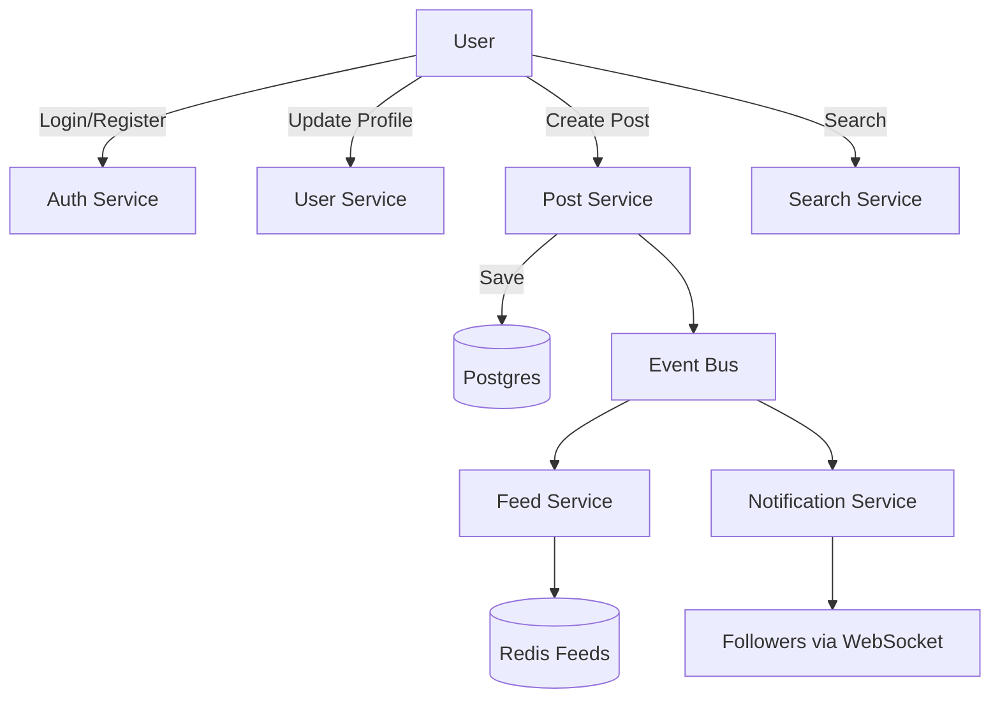
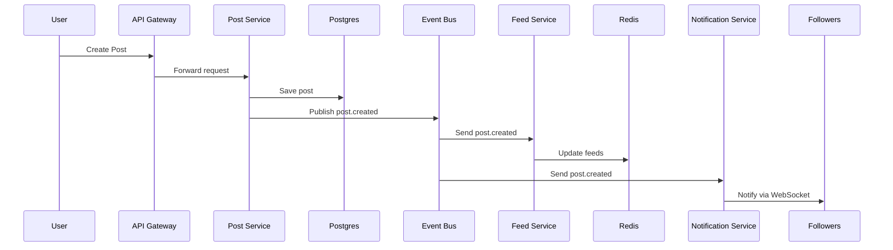

# 🔄 Phân tích luồng & chức năng của OXO.com

## 1. Luồng & chức năng tổng thể (User Journey)

- **Đăng ký/Đăng nhập**

  - User tạo tài khoản mới hoặc login bằng OAuth2 (Google, GitHub, email).
  - Backend sinh JWT / refresh token.

- **Profile**

  - User chỉnh sửa profile (avatar, bio, link).
  - Trang public profile hiển thị cho người khác.

- **Post (nội dung chính)**

  - User tạo post (text, ảnh, video).
  - Có thể like/comment/share.
  - Feed của user khác cập nhật theo follow/tương tác.

- **Feed/Timeline**

  - Timeline hiển thị post từ những người user follow.
  - Có thể có trending feed (recommendation).

- **Notification**

  - User nhận noti real-time khi có like/comment/follow mới.

- **Search & Discovery**
  - Tìm user, tìm post theo từ khoá/hashtag.

---

## 2. Luồng Frontend (Next.js)

### Các page chính

- `/` → Landing / Home
- `/feed` → timeline
- `/profile/:id` → profile page
- `/post/:id` → post detail
- `/auth/login` → login/signup
- `/settings` → chỉnh sửa profile

### Luồng frontend

- User → Browser (Next.js)
- Next.js fetch API từ backend (`/api/v1/...`)
- State management (React Query / Redux Toolkit)
- WebSocket/SSE cho notification real-time

---

## 3. Luồng Backend (NestJS)

### Microservice chính

- **Auth Service**: đăng ký/login, JWT/OAuth2, refresh token
- **User Service**: quản lý profile
- **Post Service**: CRUD post, upload media (S3/MinIO)
- **Feed Service**: tổng hợp feed (cache trong Redis)
- **Notification Service**: gửi noti real-time (WebSocket)
- **Search Service**: ElasticSearch (post, user)

### Luồng backend (ví dụ user đăng post)

1. User gửi request → API Gateway
2. API Gateway forward tới Post Service
3. Post Service ghi vào PostgreSQL + publish event `post.created` lên Kafka/BullMQ
4. Feed Service subscribe `post.created`, cập nhật timeline cache Redis cho followers
5. Notification Service bắn noti tới followers (WebSocket)

---

## 4. Sơ đồ minh họa

### 🟦 User Flow (cao cấp)

### 🟧 Sequence khi tạo Post

